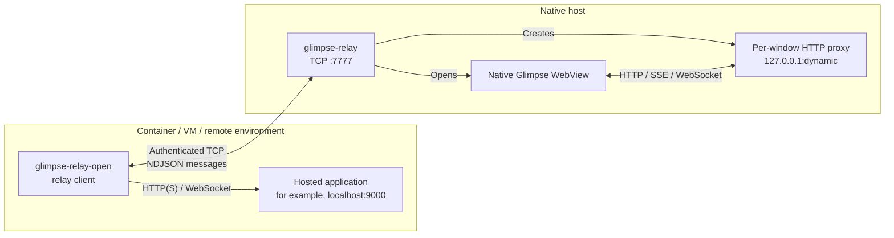
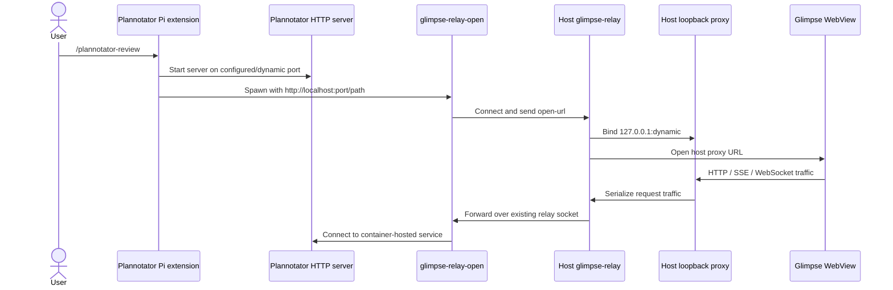
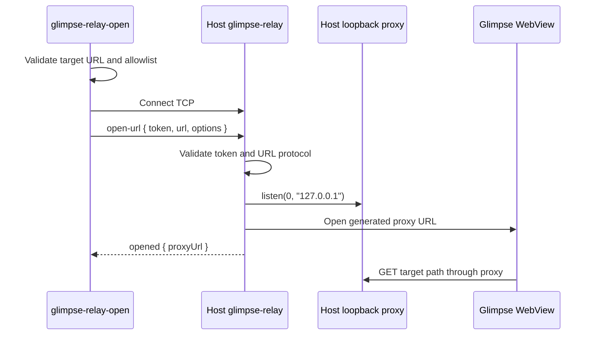
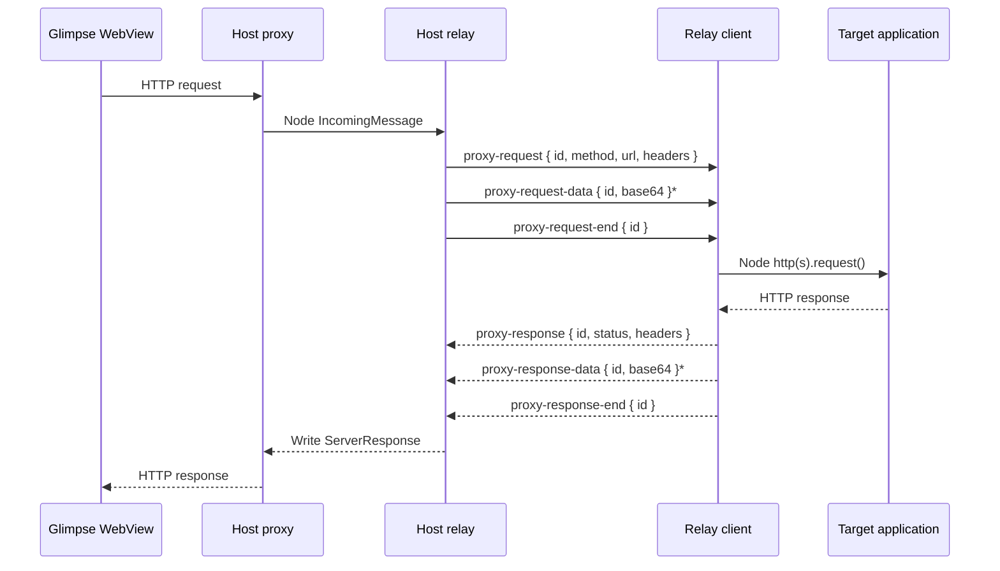

# Technical architecture

This document describes how any client-reachable web application is displayed in a native Glimpse window on another machine. The hosted-URL path is exposed by `openRelayedUrl()` and the `glimpse-relay-open` CLI. It is independent of Pi and Plannotator: containerized development servers, dashboards, local administration tools, and extension-hosted interfaces can all use the same transport.

## Example use cases

- Open a development server running inside Docker or a VM in a native host window.
- Display a local dashboard or administration UI without exposing its port on the host network.
- Integrate a tool that accepts a browser executable and passes its dynamically selected URL as the first argument.
- Display a web UI hosted by a Pi extension. Plannotator is one example of this pattern.

## Component roles



The components have deliberately different responsibilities:

- **`glimpse-relay-open`** is a small CLI and lifecycle wrapper around the relay client's `openRelayedUrl()` API. It does not listen on an HTTP port and is not itself a conventional reverse proxy.
- **The relay client library** is the container-side forwarding endpoint. It translates relay messages into Node HTTP(S) requests or upgraded sockets connected to the target application.
- **`glimpse-relay`** accepts the authenticated client connection, creates a temporary host-side HTTP proxy, and opens the native window.
- **The per-window host proxy** is the reverse proxy that the WebView accesses. It is bound exclusively to host loopback on an OS-assigned port.

Together, the relay client and host relay form an application-level HTTP/WebSocket tunnel. The host relay never connects directly to the target application.

## Example: Plannotator launched from Pi

Plannotator is an example consumer, not a protocol-specific component. It already supports a configurable browser executable, so no Pi command interception or Plannotator-specific relay behavior is required.



A fixed Plannotator port is optional, but can make diagnostics and policy easier:

```bash
export PLANNOTATOR_PORT=9000
export PLANNOTATOR_BROWSER="$(command -v glimpse-relay-open)"
```

`PLANNOTATOR_BROWSER` contains only the executable path. Plannotator supplies the actual URL—including the selected host, port, path, and query—as the executable's first argument.

## Session establishment

Each relayed window gets its own TCP connection and host-side proxy. Multiple browser requests within that window are multiplexed over that connection by request ID.



The detailed sequence is:

1. `glimpse-relay-open <url>` calls `openRelayedUrl(url)` and remains alive until the window closes or the process receives `SIGINT`/`SIGTERM`.
2. The client accepts only `http:` and `https:` URLs, rejects embedded credentials, and checks the exact target hostname against its allowlist. `localhost` and `127.0.0.1` are allowed by default.
3. The client opens a Node `net.Socket` to the configured relay endpoint, enables `TCP_NODELAY`, and sends one newline-delimited JSON `open-url` message containing the shared token, target URL, and window options.
4. The host authenticates the first open message. A relay connection can open only one window.
5. The host creates a Node HTTP server on `127.0.0.1` with port `0`, allowing the OS to select an available port.
6. The target path, query, and fragment are applied to this proxy origin. Glimpse initially receives a small HTML page that redirects its WebView to the resulting loopback URL.
7. The host returns `opened { proxyUrl }`. Subsequent `ready`, `info`, `message`, `error`, and `closed` events share the same TCP connection.

## HTTP forwarding

Forwarding happens at the application-message level rather than by copying a raw TCP stream.



For every WebView request, the host proxy:

1. Generates a UUID and stores the host `ServerResponse` under that ID.
2. sends request metadata in `proxy-request`;
3. streams request body chunks as base64-encoded `proxy-request-data` messages; and
4. finishes with `proxy-request-end`.

The client resolves the requested path against the configured target origin and refuses a result that changes origin. It creates a Node `http.request()` or `https.request()`, stores the `ClientRequest` under the same ID, and streams decoded request chunks into it.

When the target responds, the client sends status and headers in `proxy-response`, followed by zero or more base64 `proxy-response-data` chunks and `proxy-response-end`. The host uses the ID to find and complete the corresponding `ServerResponse`. IDs allow unrelated requests to remain active concurrently over the same relay socket.

If the WebView abandons a request, the host sends `proxy-request-abort` and the client destroys the target request. A target-side error is returned as `proxy-error`; the host responds with `502 Bad Gateway` when possible.

### Header and URL translation

The proxy performs the minimum translation needed to preserve the target application's origin semantics:

- The client removes hop-by-hop request headers and replaces `Host` with the target host.
- An `Origin` equal to the host proxy origin is changed to the target origin.
- A `Referer` under the host proxy origin is changed to the equivalent target URL.
- The host removes hop-by-hop response headers.
- Absolute `Location` response headers under the target origin are rewritten to the proxy origin.
- `Access-Control-Allow-Origin` equal to the target origin is rewritten to the proxy origin.

Requests cannot use an absolute URL to escape the configured target origin. The target hostname is selected when the session starts and is not supplied by individual WebView requests.

### Proxy scope

The tunnel carries navigation and same-origin traffic addressed to the temporary host proxy. Relative application requests, SSE endpoints, and WebSockets derived from `window.location` therefore use the relay automatically. An application that explicitly loads an absolute cross-origin URL causes the WebView to contact that origin directly; Glimpse currently provides no general WebView request-interception API for rerouting such traffic. Adding a hostname to `GLIMPSE_RELAY_CLIENT_ALLOWED_HOSTS` permits it as an initial relay target—it does not intercept cross-origin subresources.

The WebView-facing proxy currently uses loopback HTTP even when the client-to-target leg uses HTTPS. Applications that depend on browser-visible HTTPS origin semantics, such as `Secure` cookies, may require additional handling.

## Streaming and SSE

SSE requires no separate transport. The target response remains open, and every response chunk is immediately emitted as `proxy-response-data`. The host writes each decoded chunk to the still-open WebView response. `proxy-response-end` is sent only when the target stream ends.

The implementation applies relay-socket backpressure while forwarding HTTP request bodies and target response bodies: the source stream is paused when writing to the relay socket returns `false`, then resumed on `drain`.

## WebSocket forwarding

WebSockets start as an HTTP upgrade and then switch to bidirectional byte forwarding:

```text
Host   -> Client: proxy-upgrade { id, method, url, headers, head? }
Client -> Host:   proxy-upgrade-response { id, status, headers, head? }
Host  <-> Client: proxy-upgrade-data { id, base64 }*
Host  <-> Client: proxy-upgrade-close { id }
```

The host retains the WebView's upgraded socket by ID. The client creates an HTTP(S) upgrade request to the target and retains the resulting target socket under the same ID. Data received before the target upgrade completes is queued by the client, then written once the target socket is available.

The relay transports bytes, not parsed WebSocket frames. Upgrade heads and all later socket chunks are base64-encoded in NDJSON, so text and binary WebSocket frames follow the same path.

## Wire format

The relay protocol is newline-delimited JSON over a plain TCP socket. Each line is one complete message:

```text
{"type":"proxy-response-data","id":"...","data":"SGVsbG8="}\n
```

JSON carries metadata directly. Arbitrary HTTP body and upgraded-socket bytes are base64-encoded because JSON strings are not binary-safe. Message IDs multiplex concurrent HTTP responses and WebSocket connections over the one session socket.

The TCP transport itself is not TLS. Authentication uses the shared token in the initial `open` or `open-url` message. HTTPS, when present, is the connection from the relay client to the target application.

## Ports and network boundaries

| Component | Bind or destination | Port |
|---|---|---:|
| Host `glimpse-relay` | `127.0.0.1` by default; commonly `0.0.0.0` for Docker access | `7777` by default |
| Host per-window proxy | Always `127.0.0.1` | OS-assigned |
| Relay client | Outbound connection to host relay | OS-assigned source port |
| Target application | Reachable from the relay client's environment | Application-defined |
| Glimpse WebView | Outbound connection to host loopback proxy | OS-assigned source port |

The target application is generic and its port is not prescribed by the relay. For the Plannotator example, it commonly listens on `0.0.0.0:9000` inside the container while `glimpse-relay-open` connects to it using `http://localhost:9000/...`.

## Security boundaries

- The temporary host proxy is loopback-only and is closed with its relay session.
- The relay should require a token whenever it is exposed beyond host loopback. The install command generates and configures a token; the relay warns if it binds `0.0.0.0` without one.
- Target URL validation occurs in the client environment before the host window is opened. Additional exact hostnames require `GLIMPSE_RELAY_CLIENT_ALLOWED_HOSTS`.
- Only HTTP and HTTPS targets are accepted, embedded URL credentials are rejected, and forwarded request URLs must remain on the configured target origin.
- The host uses the target URL for proxy routing metadata and origin translation, but all target network connections originate from the relay client.

## Lifecycle and cleanup

Closing either side tears down the complete session:

- Closing the Glimpse window closes the loopback proxy and ends the relay socket.
- Closing the CLI sends `close`, destroys pending target requests and upgraded sockets, and ends the relay socket.
- Losing the relay socket closes the proxy, pending host connections, and native window.
- Host shutdown closes all tracked native windows.

This one-window-per-connection model keeps request state, proxy ports, and cleanup isolated between windows.
